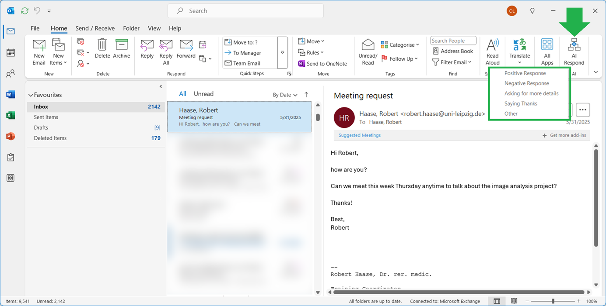
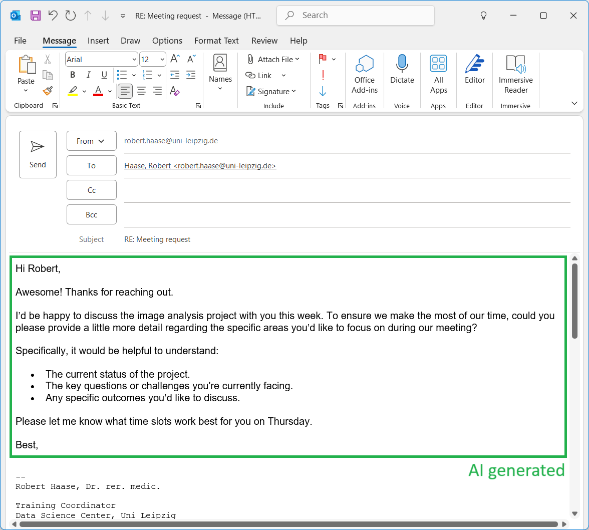

# Outlook-Bob

An LLM-based assistant for answering emails. Uses local LLMs using [ollama](https://ollama.com) for optimal privacy.

## Usage



After a moment, an email response window with an AI-generated response will open.



Outlook-bob is a research project aiming to make transparent how AI-assistants can be incorporated into email-communication in a privacy-preserving way. Under the hood it uses artificial intelligence / large language models to generate text. Users are responsible to verify the generated text before submitting the email. Outlook-Bob uses locally installed language models to ensure optimal privacy. Under the hood, no data is submitted to the internet or any LLM-service provider. 


## Setup

To make outlook-bob work in your Outlook, download this repository to a local folder, e.g. using git:

```
git clone https://github.com/haesleinhuepf/outlook-bob
```

Also download and install [ollama](https://ollama.com/). After installation, run this terminal command to download the [gemma3:4b model](https://ollama.com/library/gemma3:4b), which is used under the hood per default:

```
ollama pull gemma3:4b
```

1. VBA MAcro

Open Outlook.

Press ALT + F11 to open the VBA Editor.

Insert a new module: Right-click Project1 → Insert → Module.

Paste the code of `outlook_response.vba`. Modify the path in that file so that it points at `email_assistant.py`.

In Outlook, go to File → Options → Customize Ribbon.

Under the right-side list, pick a tab (e.g., Home) and click "New Group."

With the new group selected, click "Choose commands from: Macros."

Find Project1.GenerateReplyWithPython and click "Add."

Rename and assign an icon if you want.


2. Security/Trust Center Settings

Go to File > Options > Trust Center > Trust Center Settings > Macro Settings

Ensure "Notifications for all macros" is selected. 

If you click the Ribbon button configured above, a notification will open, asking you to activate Macros. After this, the AI-Assistant should work.

## Acknowledgements

We acknowledge the financial support by the Federal Ministry of Education and Research of Germany and by Sächsische Staatsministerium für Wissenschaft, Kultur und Tourismus in the programme Center of Excellence for AI-research „Center for Scalable Data Analytics and Artificial Intelligence Dresden/Leipzig", project identification number: ScaDS.AI
